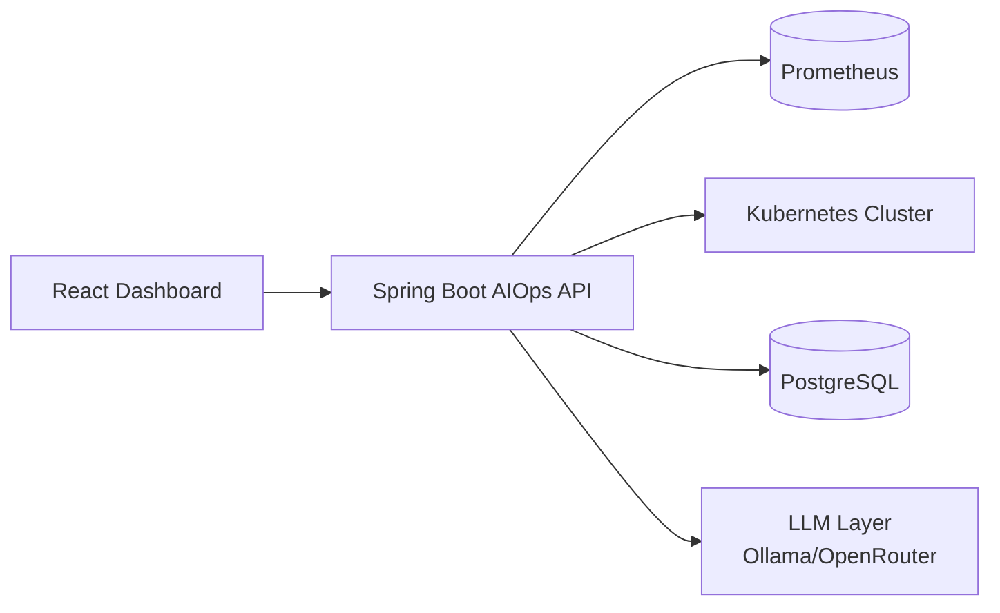
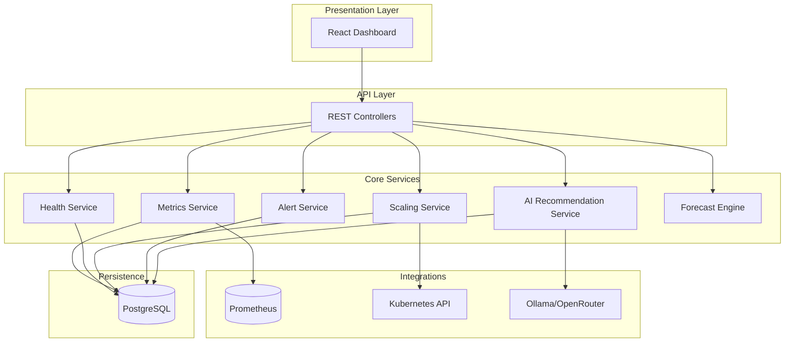
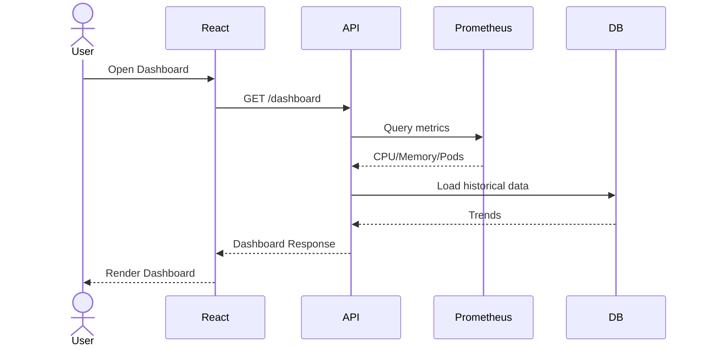
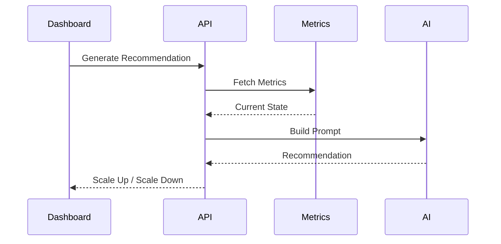
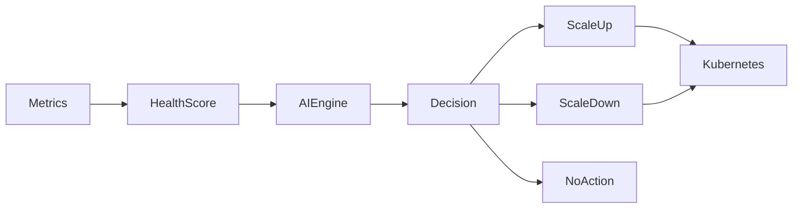
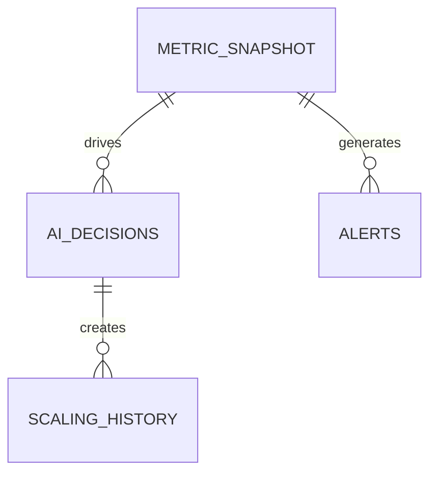
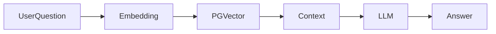
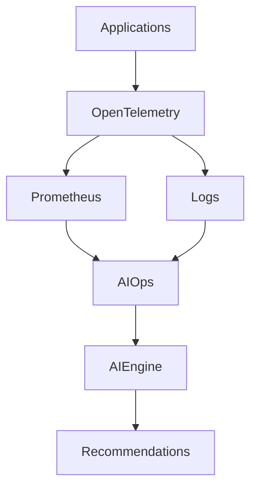
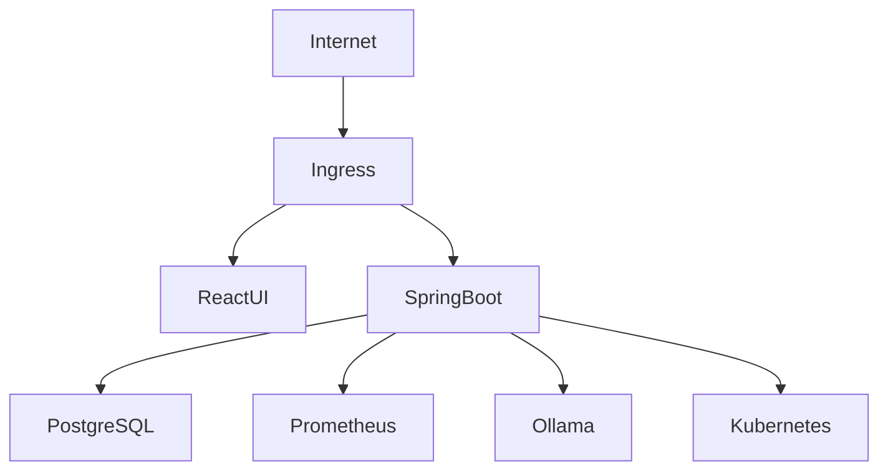

# AI Monitoring Ops Platform - Enterprise Architecture

## 1. Executive Summary

AI Monitoring Ops is an enterprise AIOps platform built using:

- Spring Boot 3.5.3
- Java 21
- React Dashboard
- PostgreSQL
- Prometheus
- Kubernetes Client
- Ollama / OpenRouter LLM Integration
- Spring AI

Primary objectives:

1. Real-time monitoring
2. AI-driven health scoring
3. Intelligent recommendations
4. Auto-scaling decisions
5. Root cause analysis
6. Forecasting
7. Autonomous remediation

---

# 2. High Level Architecture (HLD)



---

# 3. Enterprise Architecture



---

# 4. Current Package Design (LLD)

```text
com.ai.ops

├── controller
│   ├── DashBoardController
│   ├── AlertController
│   ├── ScaleController
│   ├── HealthController
│   ├── ChatController
│   └── AIDecisionController
│
├── service
│   ├── Metrics Service
│   ├── Prometheus Service
│   ├── AI Service
│   ├── Scaling Service
│   ├── Health Score Service
│   └── Forecast Service
│
├── repository
├── entity
├── client
├── config
└── event
```

---

# 5. Dashboard Request Flow



---

# 6. AI Recommendation Flow


---

# 7. Auto Scaling Flow



---

# 8. Database Design

## metric_snapshot

| Column | Type |
|----------|----------|
| id | bigint |
| created_at | timestamp |
| cpu_percent | double |
| memory_mb | double |
| running_pods | integer |
| restart_count | integer |

## alerts

| Column | Type |
|----------|----------|
| id | bigint |
| created_at | timestamp |
| severity | varchar |
| message | text |

## ai_decisions

| Column | Type |
|----------|----------|
| id | bigint |
| created_at | timestamp |
| action | varchar |
| replicas | integer |
| reason | text |
| executed | boolean |
| confidence | integer |
| ai_explanation | text |

## scaling_history

| Column | Type |
|----------|----------|
| id | bigint |
| created_at | timestamp |
| action | varchar |
| replicas | integer |
| reason | text |
| confidence | integer |
| ai_explanation | text |

---

# 9. Entity Relationship Diagram



---

# 10. Health Score Engine

Health Score Formula

Health = 100
 - CPU Weight
 - Memory Weight
 - Restart Weight
 - Alert Weight

Suggested weights:

- CPU = 30%
- Memory = 30%
- Restarts = 20%
- Alerts = 20%

---

# 11. Future Enterprise Roadmap

Phase 1
- Health Score
- Explainability
- Root Cause Analysis
- Forecasting

Phase 2
- AI Chat Assistant
- Anomaly Detection
- Executive Summary

Phase 3
- Autonomous Remediation
- Cost Optimization

Phase 4
- Deployment Risk Analysis
- Multi Cluster Intelligence
- SRE Copilot

---

# 12. Recommended Enterprise Enhancements

## Vector Database

PGVector

Store:

- Incident history
- RCA reports
- Scaling actions
- Deployment failures
- Knowledge articles

## RAG Architecture



---

# 13. Observability Architecture



---

# 14. Security Architecture

- JWT Authentication
- RBAC
- Audit Logging
- API Gateway
- Secrets Management
- TLS Everywhere
- Kubernetes Service Accounts

---

# 15. Production Deployment



This document was generated from the uploaded AI Monitoring Ops project structure and enhanced with enterprise-grade architecture recommendations aligned with the platform roadmap.
